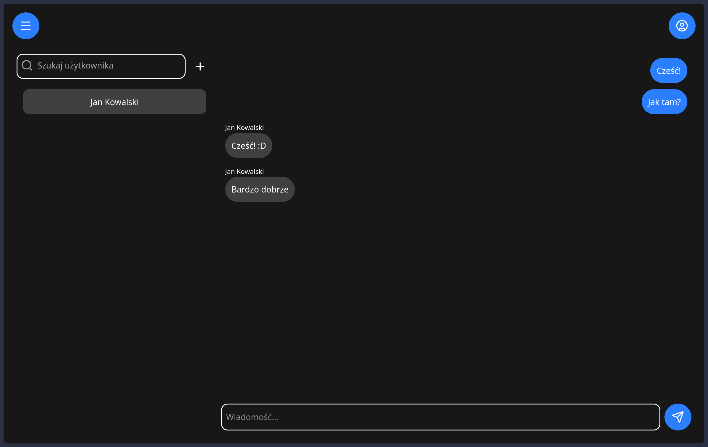

# Komunikator

Prosta aplikacja webowa do komunikowania się.

&nbsp;

*Działanie aplikacji*

&nbsp;

## Użyte technologie

- React
- Express.js
- Socket.io
- Tailwind

## Instrukcja uruchamiania

Żeby uruchomić serwer aplikacji, trzeba najpierw utworzyć pliki:

-  .env tak jak w pliku example.env.txt i wypełnić wartości dowolnymi napisami
- frontend/.env.local tak jak w pliku frontend/example.env.local.txt i wypełnić wartościami:

        VITE_SERVER_URL=adres url backendu
        VITE_AUTH_SERVER_URL=adres url backendu związanego z logowaniem (backend/authServer.js)

- backend/config/config.json tak jak w pliku backend/config/example-config.json i wypełnić wartości. Jest to plik konfiguracyjny do połączenia z bazą danych.

Następnie trzeba utworzyć bazę danych o nazwie wskazanej w pliku backend/config/config.json

Po utworzeniu i wypełnieniu wszystkich plików konfiguracyjnych możemy uruchomić serwer za pomocą komendy:

    npm run dev

*To jest dopiero pierwsza wersja aplikacji. W następnej dodane zostaną powiadomienia i możliwość zmiany schematu kolorów*
